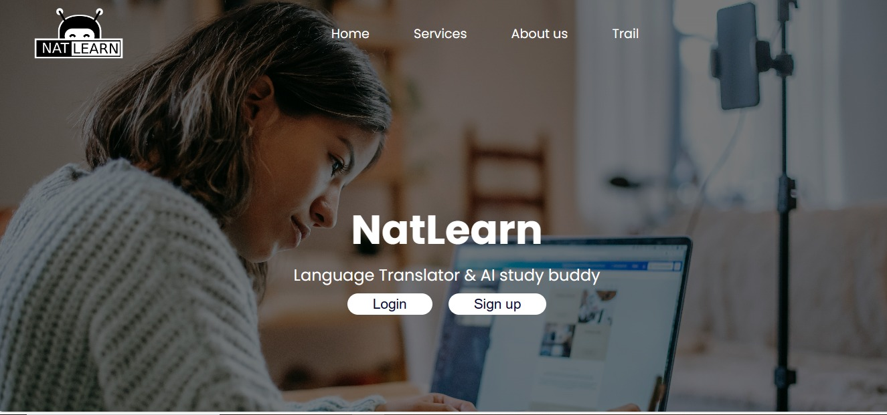
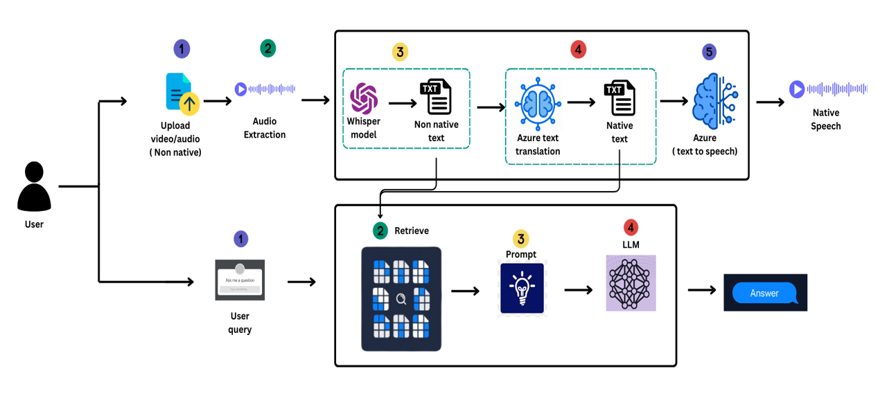
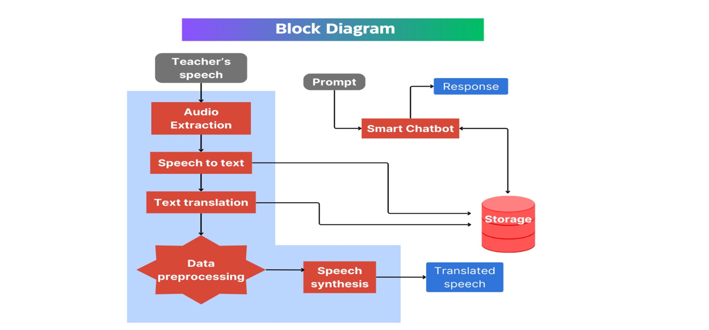

# AI Challenge 2024
## NatLearn: Multilingual Video Translator and Context Specific Chatbot



NatLearn is a multilingual video translator and RAG (retrieval augmented generation) chatbot application. It aims to overcome language barriers faced by users all over the world by empowering them to translate videos from non-native languages into their native language. This is complemented by a context-aware chatbot capable of addressing queries by leveraging the information present in the user's uploaded videos. 

NatLearn uses state-of-the-art AI models and techniques to promote greater accessibility and comprehension in education.

## Demo Video
https://github.com/azamafridi23/2024-AI-Challenge-NatLearn/assets/108652143/170e187e-9747-401f-8de0-4102c4bfe1ee


## High Level Diagram
### Diagram 1

### Diagram 2



## Models Used
### For Video/Speech Translation:
- Speech To Text: OpenAI Whisper 
- Text Translation: Microsoft Azure's Text Translation / Meta's NLLB
- Text to Speech: Microsoft Azure's Speech Synthesis / Meta's MMS

### For Chatbot:
- Large Language Model (LLM): LLama2 / OpenAI GPT 3.5/ Mistral
- Embedding Model: Instruct Embedding / OpenAI Ada
- Vector Database: FAISS / ChromaDB

## Pre requisites
- Make sure your device is CUDA-Capable device(meaning that it has a GPU and CUDA Enabled)


## Installation
1) Create a virtual environment named ai_challenge with python 3.10 in it
```
conda create --name ai_challenge python=3.10
```
2) Activate ai_challenge virtual environment
```
conda activate ai_challenge
```
3) Install pytorch==2.0.0 torchaudio==2.0.0 pytorch-cuda=11.8 -c pytorch -c nvidia in it
```
conda install pytorch==2.0.0 torchaudio==2.0.0 pytorch-cuda=11.8 -c pytorch -c nvidia
```
4) Install whisperx module in it for speech to text translation
```
pip install git+https://github.com/m-bain/whisperx.git
```
5) Install ffmpeg for audio/video processing
### On Linux
```
sudo apt update

sudo apt install ffmpeg
```
### On Windows
- https://ffmpeg.org/download.html

6) Clone this(2024-AI-Challenge-NatLearn) repository

7) Install libraries in requirements.text using any of the below method. Try the other if one doesn't work
- Run the shell script using shell script
```
./install_requirements.sh
```
- Using pip
```
pip install -r requirements.txt
```
8) Rename the '.env_example' to '.env and enter your azure resource endpoint credentials to the key values. Or write me an email at `azafridi9547@gmail.com` so that I can provide you temporary credentials for testing purposes.
8) Make migrations for django application to run properly
```
python manage.py migrate
```
9) Run the application
```
python manage.py runserver
```
10) Open your browser and go to http://127.0.0.1:8000/

11) Register and login

12) Go to video translator 

13) Give a title for your video, upload a video shorter that is shorter than 2 minutes. You can use the video available in the demo_video folder, select the source and target language of the video, select the gender voice and click the upload button.

14) Wait until the translated video appears(the first time you upload a video, it will take longer time because `whisper` model for speech to text translation will be downloaded). 

# NOTE: IF THE FRONTEND OF THE PAGE GETS DUPLICATED THEN REFRESH THE PAGE ONCE AND IT WILL SOLVE THIS ISSUE.


## Documentation

Backend code for Video translation and Chatbot is available in the following path:
```
2024-AI-Challenge-NatLearn/accounts/azam_module/
```

### Details about Video Translation code files
- MEGA_PIPELINE_VT.py = Contains the complete pipeline which produces translated video when a video is provided to it.

### Details about Chatbot code files
- MEGA_PIPELINE_CHATBOT.py = Contains the complete pipeline which produces context relevant text when a query is made.
